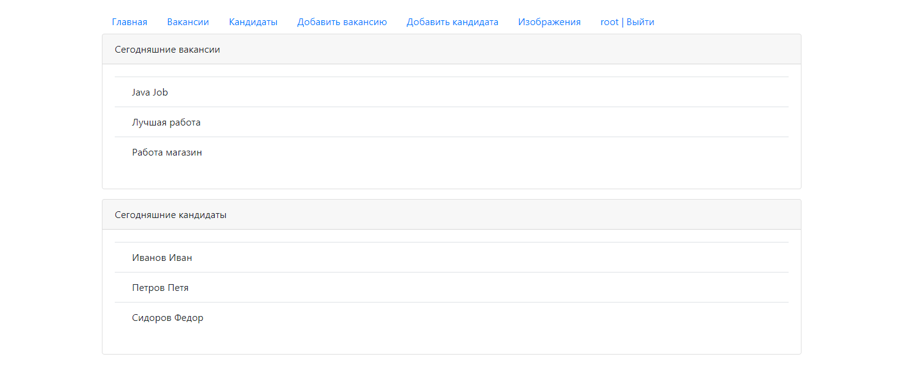
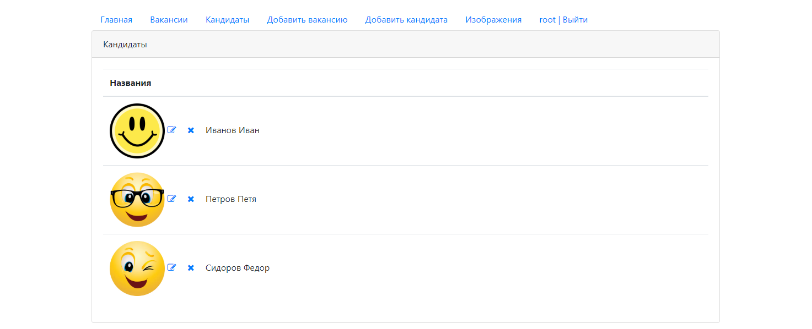
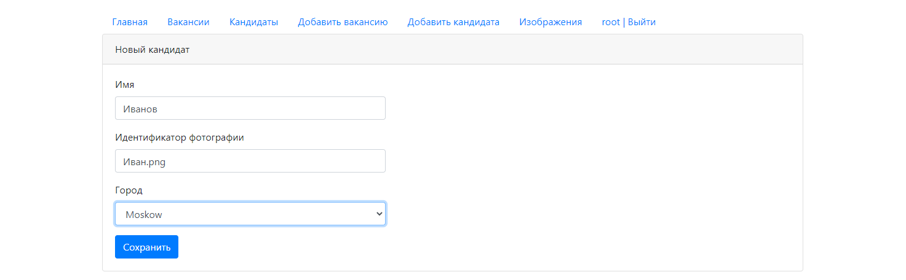
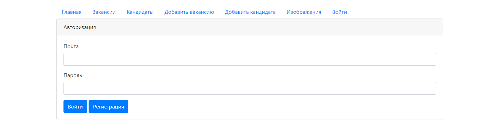

# Dream Job 
###### Servlets, Tomcat, PostgreSQL, HTML, CSS, JavaScript, Ajax, JSON
The Web Service Jobs. Training project, development of a system that allows candidates to publish resumes, HR managers to publish job vacancies.
Candidates can respond to the vacancy. The HR Manager can invite a candidate to the vacancy.

# Dream Job
Приложение биржа работы. Учебный проект, разработка системы позволяющей кандидатам публиковать резюме, кадровикам публиковать вакансии о работе. 
Кандидаты могут откликнуться на вакансию. Кадровик может пригласить на вакансию кандидата.

## Screenshots:

##

##

##

##

##

#
