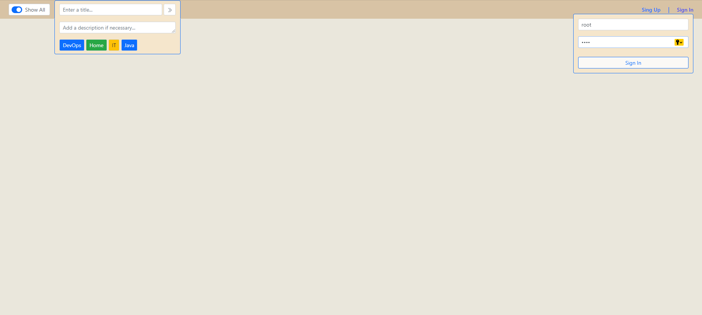
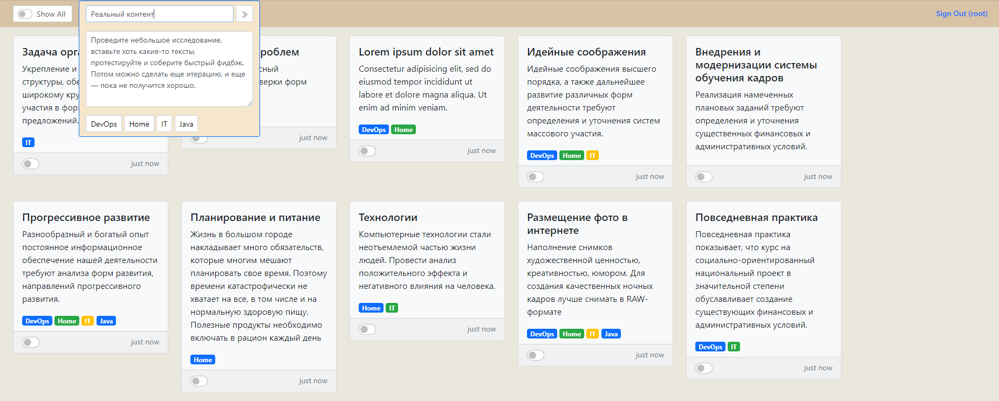

# To-Do List
Training web project using Hibernate, Servlets, Ajax, Boostrap, HTML, CSS, JQuery/JS

To-Do List is a simple web application for maintaining a list of tasks. The user interacts with a single page on
which contains the form for adding a new task, a list of tasks with a mark on completion. The user can filter tasks - 
all to-do list or not completed task. All data of the main form is loading via ajax, the database contains only one 
table with tasks.

# To-Do List
Учебный веб-проект с применением технологий Hibernate, Servlets, Ajax, Boostrap, HTML, CSS, JQuery/JS

To-Do List - простое веб-приложение для ведения списка заданий. Пользователь взаимодействует с одной страницей, на 
которой расположена форма добавления новой задачи, список задач с отметкой о выполнении. Предусмотрена возможность 
фильтрации заданий - весь список, только не выполненные. Все данные основной формы загружаются через ajax, база 
данных содержит только одну таблицу с заданиями. 

## Screenshots:

####
