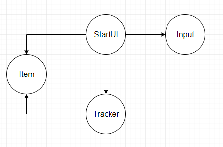

# Проект "Трекер"
Проект "Трекер" - система заявок, консольное приложение, упрощенная модель корпоративного проекта.
Продемонстрировано применение основных концепций ООП, работа с JDBC, Hibernate.

##### Функциональность программы
1. Добавление заявки.
2. Замена заявки на новую по ID.
3. Удаление заявки по ID.
4. Отображение списка всех заявок.
5. Поиск заявки по имени.
6. Выход  из программы.

##### Основной сценарий. 
Пользователь запускает программу, отображается меню, программа просит ввести в консоль пункт для дальнейшего действия. 
Например, пользователь ввел цифру 1. Система просит пользователя ввести имя заявки. 
После этого действия система сохраняет в памяти заявку и снова отображает пункты меню. Пункт 6 - это выход из программы. 

##### Элементы архитектуры
Проект использует принципы ООП за счет чего возможно его расширение, без изменения существующего кода. 

Интерфейс ru.job4j.tracker.Store описывает хранилище.  
Этот объект умеет: добавлять, заменять, искать по имени, читать все сохраненные заявки.

Класс ru.job4j.tracker.Item описывает модель данных, т.е. заявку. 

Класс ru.job4j.tracker.StartUI управляет меню. В нем основной цикл программы опрашивает пользователя о выбранном пункте 
меню. 

Действия меню описаны группой классов, основанных на интерфейсе ru.job4j.tracker.UserAction. 
Если потребуется добавить новое действие, то благодаря ООП, достаточно добавить еще один объект без внесения изменений 
в другие классы. 

В этом проекте используется внешний ресурс - система ввода-вывода, однако прямое использование в проекте стандартных 
классов ввода-вывода Java ограничит возможности тестирования и не позволить, при необходимости, перейти от консольной 
версии к другому интерфейсу взаимодействия пользователя с программой. 
По этой причине введен интерфейс ru.job4j.tracker.Input. Объекты реализующие этот интерфейс будут отвечать 
за ввод данных. Здесь используется множественное определение ввода данных, потому что в системе будут два объекта, 
отвечающих за ввод данных. Один для консоли, другой для тестов. Замена в программе этих объектов не повлечет к 
изменению кода. Это также возможно за счет применения принципов ООП.

##### Схема зависимости объектов:

Самым зависимым объектом является StartUI. Это логично, т.к. он управляет всем циклом программы и оперирует остальными
объектами. 